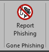
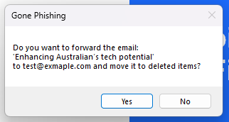
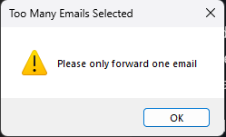
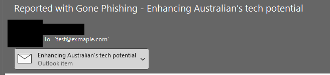

# Gone Phishing

-------------------

This add-in for Outlook will add a new button to the main ribbon, and should be used as a simple solution for reporting SPAM and Phishing emails to an assigned address:<br>


When clicked, it will ask if you want to forward the selected email, and move the item to deleted item:<br>
<br>
Hitting 'No' will stop all functions, hitting yes will make it happen.

If you try and forward multiple emails by selecting more then one, it'll throw an error:<br>


After selecting 'Yes', the add-in will create a new mail item, attach the sus email to it, and send it onto the address. In sent items it will look like:<br>


When the window is too narrow to lay the group out in full, it scales down to a single icon.

## Requirements

- Outlook 2016 or later, **desktop**, on 64-bit Windows
- .NET Framework 4.7.2
- A reporting address, set at install time or by Group Policy — see below

It's a COM add-in, so it loads in classic desktop Outlook only. It does not appear in **New
Outlook**, Outlook on the web, mobile, or Mac — Microsoft's migration to New Outlook is worth
factoring into any long-term rollout.

## Configuration

| Value | Type | Purpose |
| --- | --- | --- |
| `ReportTo` | String | Address reports are sent to. Nothing is sent if this is missing. |
| `Prefix` | String | Prepended to the subject of the report. Optional. |

Either can be set at install time or by Group Policy. Three locations are checked, first match
wins:

| Order | Hive | Key | Set by |
| --- | --- | --- | --- |
| 1 | `HKLM` | `Software\Policies\iron-jay\GonePhishing` | Computer policy |
| 2 | `HKCU` | `Software\Policies\iron-jay\GonePhishing` | User policy |
| 3 | `HKLM` | `Software\iron-jay\GonePhishing` | The installer |

So **policy supersedes the installed value** — you can retarget a deployed fleet by GPO without
reinstalling, and without having to clear what the installer wrote. Every location is one only an
administrator or Group Policy can write, so a user can't quietly redirect their own reports.

If nothing is configured anywhere, the add-in says so and sends nothing rather than failing
silently.

Both the 64-bit and 32-bit registry views are checked at each location, so Office bitness doesn't
matter.

## Group Policy (ADMX)

The administrative template lets the two settings be managed from the Group Policy editor rather
than as raw registry values. The MSI installs it beside the assembly:

```
C:\Program Files\Gone Phishing\GonePhishing.admx
C:\Program Files\Gone Phishing\en-US\GonePhishing.adml
```

Installing it doesn't put any policy into effect — copy the pair, keeping the `en-US` subfolder,
into the domain Central Store:

```
\\<domain>\SYSVOL\<domain>\Policies\PolicyDefinitions\GonePhishing.admx
\\<domain>\SYSVOL\<domain>\Policies\PolicyDefinitions\en-US\GonePhishing.adml
```

They then appear under **Administrative Templates → iron-jay → Gone Phishing**, at both computer
and user scope. The source copies live in `Policies/` in this repo.

## Building

It's an ordinary .NET Framework 4.7.2 class library — a plain COM add-in, not VSTO. There's no
ClickOnce manifest, so no signing certificate is needed to build it:

```bash
msbuild "Gone-Phishing/Gone Phishing.csproj" /t:Rebuild /p:Configuration=Release
```

The only output that matters is `Gone Phishing.dll`. The Office interop types are embedded, so
the primary interop assemblies do not need to be present on the client — which matters, because
Click-to-Run Office doesn't install them.

## Installer

One WiX project, one MSI, both Office bitnesses. WiX comes from NuGet, so nothing has to be
installed first — `msbuild /t:Restore` fetches it:

```bash
msbuild Gone_Phishing.sln /t:Restore,Build /p:Configuration=Release /p:Platform=x64
```

Output lands in `GP_Setup/bin/x64/Release/GonePhishing.msi`.

There's no separate 32-bit package to choose between. Outlook only reads the registry view
matching its own bitness, so the package registers the add-in twice: once in the native view and
once, via a `Bitness="always32"` component, under `Software\WOW6432Node\...`. The assembly itself
is AnyCPU, so the single copy in Program Files loads in either host. The only requirement is
64-bit Windows — 32-bit Office on 64-bit Windows is covered.

Both settings can be supplied on the command line as install-time defaults:

```bash
msiexec /i GonePhishing.msi REPORTTO=phishing@example.com "PREFIX=[Suspicious] " /qn
```

Either can be omitted — leave them out entirely if Group Policy is going to own them. A value is
only written when supplied, so an upgrade that passes nothing won't blank out what an earlier
install set.

The MSI declares an `UpgradeCode`, so a newer build replaces an older one in place instead of
installing alongside it.

> WiX is pinned to v5. Versions 6 and 7 require accepting the Open Source Maintenance Fee EULA,
> which is a licensing call to make deliberately rather than a build detail.

## Registering it manually

For development, or if you'd rather not use the MSI, the assembly can be COM-registered directly.
Use the `RegAsm` matching your **Office** bitness, not the OS — 64-bit Office needs the
`Framework64` copy:

```bash
C:\Windows\Microsoft.NET\Framework64\v4.0.30319\RegAsm.exe "Gone Phishing.dll" /codebase
```

For 32-bit Office, use `C:\Windows\Microsoft.NET\Framework\v4.0.30319\RegAsm.exe` instead. Run it
elevated — it writes to `HKLM`. `/codebase` is required because the assembly isn't in the GAC; it
records the DLL's full path, so register it where it will actually live, not from a build folder.

Registration also writes `FriendlyName`, `Description` and `LoadBehavior` to
`HKLM\Software\Microsoft\Office\Outlook\Addins\GonePhishing.Connect`, and clears the key name and
`Manifest` value left behind by older builds. Your `ReportTo` and `Prefix` policy is untouched —
it lives under `Software\Policies\...` and nothing here reads or writes the add-in key for it.

> The add-in key's name has to match the ProgID exactly. Outlook treats the key name as the
> ProgID it looks up, and reports "not a valid Office Add-in" if the two disagree.

To remove it, add `/unregister` (without `/codebase`).

## Caveats

The main caveat is that the email will send from the primary one set in Outlook. So if you had additional mailboxes added (like a delegate or group mailbox), and you report a suspicious email, it will appear in _your_ sent items, not the mailbox it may have come into

The assembly isn't strong-named or signed. That's fine for an internal rollout, but if you're
deploying it widely, a code-signing certificate is worth having so the binary's provenance is
verifiable.

Like anything, make sure you test properly before doing a larger rollout.
